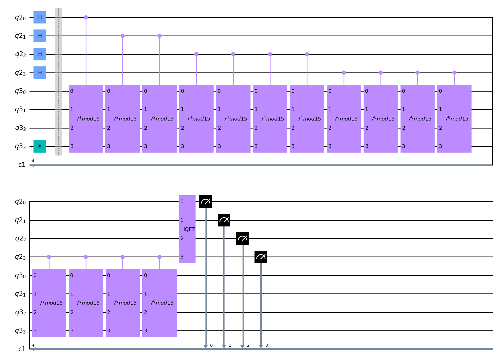

# Shor's algorithm

## Description:

A implementation of Shor's algorithm that works for an arbitrary number. 

## How to use:

### Installing requirements:

`git clone https://github.com/jvscursulim/shor_algorithm`

`pip install -r requirements.txt`

### Code example:

Factoring `number=15`.

```python
from shor import ShorAlgorithm

number = 15
num_qubits_qft = 2
shots = 8192

shor = ShorAlgorithm()

factors = shor.get_number_prime_factors(number=number, num_qubits_qft=num_qubits_qft, shots=shots)

print(factors)
```

Output: `{3,5}`

### Quantum Circuit of code example:



## References:

[Qiskit Textbook - Shor's algorithm](https://qiskit.org/textbook/ch-algorithms/shor.html)
